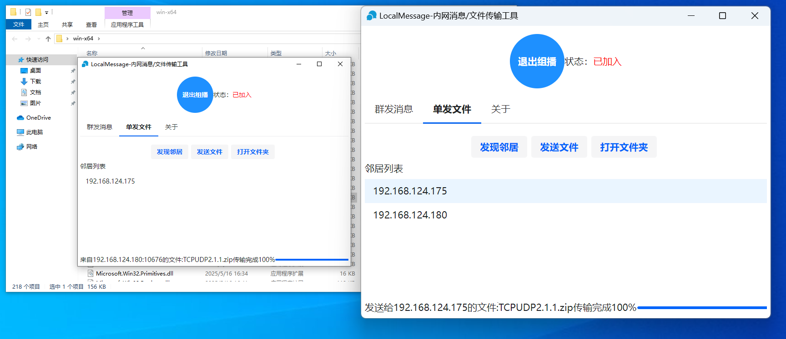

## .NET8 + AvaloniaUI 11的局域网消息群发、文件收发工具

* 项目运行截图：Win10 Win11🪟
  
  
* deepin25🐧
```
# 查看当前DPI设置
xrdb -query | grep Xft.dpi

# 如果无输出或值异常，手动设置DPI（示例值为96）
echo "Xft.dpi: 96" | xrdb -merge

```

##  功能介绍 ⚡ 高性能 🌐 跨平台
## 开发进度
- [x] ✅ **加入/退出组播**：已完成  
- [x] ✅ **发送消息**：已完成  
- [x] ✅ **群发消息**：已完成
- [x] ✅ **基于组播的邻居发现**：已完成
- [x] ✅ **收发文件**: 已完成
- [x] ✅ **收发文件进度显示**: 完成
- [ ] ⏳ **基于广播的邻居发现**: 开发中
